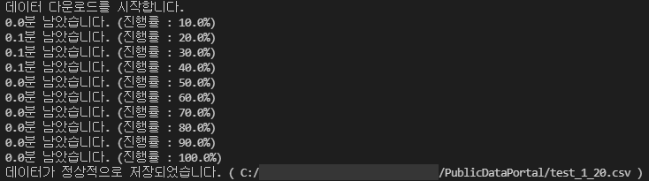

# Public Data Portal

https://www.data.go.kr/


### \<List>
- [Request Data 3 (2022.9.21)](#request-data-3-2022921)
- [Request Data 2.2 (2021.12.09)](#request-data-22-20211209)
- [Request Data 2.1 (2021.12.09)](#request-data-21-20211209)
- [Request Data 2 (2021.12.08)](#request-data-2-20211208)
- [Request Data 1 (2021.12.04)](#request-data-1-20211204)


## [Request Data 3 (2022.9.21)](#list)

- Divide files
  - `setting.py` : contains parameters controlled by user
  - `key.py` : contain encryption keys (one user has the same keys whatever the data is)
  - `operation.py` : don't need to change the codes of operation part
- ~~Can receive multi-results from one page~~ (next task)
- Do not suspend, by the reason that can be discovered before operation, after operation
- Use file system so that can save partial data even if it stop unexpectedly

  <details>
    <summary>Codes</summary>

    #### `RequestData_3_Run.py`
    ```python
    import Key                      as Key
    import RequestData_3_Operation  as Operation
    ```
    ```python
    ###################################### SETTING ##########################################

    # (1) 데이터 제목 : 공공데이터포털 > 오픈API > 금융위원회_채권발행정보 > 발행자별발행종목현황조회
    # (2) 페이지 링크 : https://www.data.go.kr/data/15043421/openapi.do

    # (3) 요청주소
    url = 'http://apis.data.go.kr/1160100/service/GetBondTradInfoService/getIssuIssuItemStat'

    # (4) pageNo의 시작과 끝, 간격
    page = {
        'start' : 1,
        'end' : 10,                                                                             # ★ 테스트시에는 충분히 작은 숫자를 대입 : ex. 10
        'interval' : 1,
    }

    # (5) 데이터 저장 경로 및 파일명
    path = {
        'path' : '.',                                                                           # . : 현재 위치를 의미
        'fileName' : '발행자별발행종목현황조회',                                                  # 확장자 없이 입력
    }

    # (6) 요청 시간 간격 (초)
    sleepTime = 0                                                                               # 단기적인 트래픽 제한이 없다면 0으로 유지

    # (7) 요청변수
    params = {
        'serviceKey' : Key.decodingKey,                                                         # .encodingKey로 설정시 오류 발생; SERVICE_KEY_IS_NOT_REGISTERED_ERROR
        'pageNo' : '1',                                                                         # 1로 고정
        'numOfRows' : '1',                                                                      # 페이지당 결과수 (복수값 적용은 개발중)
        'resultType' : 'xml',                                                                   # xml/json 중에서 선택 가능하나, 본 프로그램은 xml만을 지원함
        # 'basDt' : '20201116',
        # 'crno' : '1101110084767',
        # 'bondIsurNm' : '국동'
    }

    # (8) 출력결과
    columns = [
        "resultCode",
        "resultMsg",
        "numofrows",
        "pageno",
        "totalCount",
        "basDt",
        "crno",
        "bondIsurNm",
        # add more columns
    ]

    #########################################################################################
    ```
    ```python
    # 실행
    if __name__ == "__main__" :

        Operation.Operation(
            url,
            page,
            path,
            sleepTime,
            params,
            columns
        )
    ```

    #### `RequestData_3_Operation.py`
    ```python
    import  requests                                # REST API 호출
    from    bs4         import  BeautifulSoup       # XML 데이터 해석
    import  csv                                     # .csv 파일로 저장
    import  time                                    # 실행시간 측정
    import  math                                    # 반올림; .floor(), .ceil()
    import  os                                      # 파일명 중복 체크
    ```
    ```python
    # bs4Test : params에 최초 설정된 대로 xml 다운로드 테스트
    def bs4Test(url, params, run = True) :
        if run :
            response = requests.get(url, params=params)                                         # . get() 자체적으로 encoding을 하므로 decoding key를 사용
            soup = BeautifulSoup(response.content, "html.parser")                               # 'b 삭제, 행갈이 추가
            print("soup\t\t\t:\n", soup)                                                        # 테스트 출력
    ```
    ```python
    def Operation(
        url,
        page,
        path,
        sleepTime,
        params,
        columns,
        test = False
        ) :

        # 총 페이지 수
        totalPage = int((page['end'] - page['start'])/page['interval']) + 1

        # 저장 경로 & 파일명 설정
        savePath = path['path'] + '/' + path['fileName'] + '_' + str(page['start']) + "_" + str(page['end']) + ".csv"

        # columns → "item.****.text"꼴로 변환 (xml 문서 분석용)
        soupColumns = []
        for c in columns :
            soupColumns.append("item." + c.lower() + ".text")

        # 다운로드 개시 전 테스트
        if test :
            print("<테스트 모드>")    
            print("totalPage\t\t:", totalPage)
            print("savePath\t\t:", savePath)
            print("soupColumns (Top 5)\t:", soupColumns[0:5])
            bs4Test(url, params, False)                                                         # bs4Test : params에 최초 설정된 대로 xml 다운로드 테스트, (run = False : 실행 X)

        # 다운로드
        obs = 1
        # startTime = time.perf_counter()                                                       # 시작 시간

        with open(savePath, 'a', newline='') as f:                                              # f: 띄어쓰면 오류

            wr = csv.writer(f)

            if os.path.getsize(savePath) > 0 :                                                  # 실행 전 파일명 중복 여부 검사
                print("이미 존재하는 파일에 이어씁니다. (", savePath, ")")
            else :
                wr.writerow(columns)                                                            # 최초 작성시 1행에 헤더 라인 삽입 (변수명)

            for i in range(page['start'], page['end'] + 1, page['interval']) :

                if test :
                    print(i)

                params['pageNo'] = i
                response = requests.get(url, params=params)                                     # . get() 자체적으로 encoding을 하므로 decoding key를 사용
                soup = BeautifulSoup(response.content, "html.parser")                           # 'b 삭제, 행갈이 추가

                # Stack data into pandas data frame (on memory)
                for item in soup.findAll("response") :                                          # 모든 데이터는 <body> </body> 태그 사이에 위치
                    temp = []
                    for j in range(0, len(soupColumns)) :
                        if eval(soupColumns[j]) != None :                                       # 각 데이터 열(태그) 존재 여부 확인
                            temp.append(eval(soupColumns[j]))                                   # eval() : "item.numofrows.text" to item.numofrows.text
                        else :
                            temp.append("")                                                     # 빈 태그에 "" 삽입
                    if test :
                        print(temp)                                                             # test
                    wr.writerow(temp)
    ```
    ```python
    if __name__ == "__main__" :

        import RequestData_3_Run as Run

        Operation(
            Run.url,
            Run.page,
            Run.path,
            Run.sleepTime,
            Run.params,
            Run.columns,
            test = True
        )
    ```
  </details>

    #### Output : `발행자별발행종목현황조회_1_10.csv`
    ```csv
    resultCode,resultMsg,numofrows,pageno,totalCount,basDt,crno,bondIsurNm
    00,NORMAL SERVICE.,1,1,47248,20200715,1101110168595,삼성중공업
    00,NORMAL SERVICE.,1,2,47248,20200715,1101110377203,현대카드
    00,NORMAL SERVICE.,1,3,47248,20200715,1101110672538,하나은행
    00,NORMAL SERVICE.,1,4,47248,20200715,1101112615578,메지온
    00,NORMAL SERVICE.,1,5,47248,20200715,1101114546523,KB국민카드
    00,NORMAL SERVICE.,1,6,47248,20200715,1101116837772,키움캐피탈
    00,NORMAL SERVICE.,1,7,47248,20200715,1101350000903,중소기업은행
    00,NORMAL SERVICE.,1,8,47248,20200715,1101350000937,한국산업은행
    00,NORMAL SERVICE.,1,9,47248,20200715,1641710000052,한국수자원공사
    00,NORMAL SERVICE.,1,10,47248,20200716,1101110003668,한진
    ```

    #### Output : Test Mode
    ```
    <테스트 모드>
    totalPage               : 10
    savePath                : ./발행자별발행종목현황조회_1_10.csv
    soupColumns (Top 5)     : ['item.resultcode.text', 'item.resultmsg.text', 'item.numofrows.text', 'item.pageno.text', 'item.totalcount.text']
    1
    ['00', 'NORMAL SERVICE.', '1', '1', '47248', '20200715', '1101110168595', '삼성중공업']
    2
    ['00', 'NORMAL SERVICE.', '1', '2', '47248', '20200715', '1101110377203', '현대카드']
    3
    ['00', 'NORMAL SERVICE.', '1', '3', '47248', '20200715', '1101110672538', '하나은행']
    ……
    10
    ['00', 'NORMAL SERVICE.', '1', '10', '47248', '20200716', '1101110003668', '한진']
    ```


## [Request Data 2.2 (2021.12.09)](#list)

- Add a loop to **request missing data** in `2.4` (repeatable)
- Fill empty(or absent) tag with `""`, instead of the process stop with an error occurrence

  <details>
    <summary>Mainly changed parts from <i>Request Data 2.1 (2021.12.09)</i></summary>

    #### 2.3 Loop to request data continously
    ```python
        # …… skipped the above codes that have no change ……

        # Stack data into pandas data frame (on memory)
        for item in soup.findAll("body") :                                                      # all data are located between <body> and </body> tags
            temp = []
            for j in range(0, len(soupColumns)) :
                if eval(soupColumns[j]) != None :                                               # check if the tag exists
                    temp.append(eval(soupColumns[j]))                                           # eval() : "item.numofrows.text" to item.numofrows.text
                else :
                    temp.append("")                                                             # fill "" when there is no data in the tag
                # print(temp)                                                                   # test : ok - for finding where an error occurs
            df.loc[i] = temp
    ```

    #### 2.4 Loop to request missing data 
    ```python
    missingPage = (endPage - startPage + 1) - len(df)                                           # get the number of missing data
    measurePerfTerm = max(1, totalPage / 10)                                                    # check the completion ratio 10 times
    if missingPage == 0 :
        print("누락된 데이터가 없습니다.")
    else :
        print("누락된 데이터({}건)의 추가 다운로드를 시작합니다.".format(missingPage))
        startTime = time.perf_counter()                                                         # set the reference point to measure performance
        for i in range(startPage, endPage + 1) :                                                # endPage + 1 → run until endPage

            # Measure the completion ratio and avoid the data request frequency limmit if it exists (180 sec.)
            if (i != startPage) and (i % measurePerfTerm == 0 or i == endPage)  :
                elapseTime = time.perf_counter() - startTime
                completionRatio = (i - startPage + 1) / totalPage
                print("{:0,.1f}분 남았습니다. (진행률 : {:0,.1f}%)".format((elapseTime / completionRatio - elapseTime) / 60, completionRatio * 100))
                # time.sleep(sleepTime)

            # find if missing data
            if i not in df['pageno'] :

                # Refine raw XML data to be suitable with pandas dataframe 
                params['pageNo'] = i
                response = requests.get(url, params=params)                                     # doesn't require encoding key, but decoding key
                # print(response.content)                                                       # test : .content is necessary, not use only response
                soup = BeautifulSoup(response.content, "html.parser")                           # remove 'b and run line replacement

                # stack data into pandas data frame (on memory)
                for item in soup.findAll("body") :                                              # all data are located between <body> and </body> tags
                    temp = []
                    for j in range(0, len(soupColumns)) :
                        if eval(soupColumns[j]) != None :                                       # check if the tag exists
                            temp.append(eval(soupColumns[j]))                                   # eval() : "item.numofrows.text" to item.numofrows.text
                        else :
                            temp.append("")                                                     # fill empty(or absent) tag with ""
                        # print(temp)                                                           # test : ok - for finding where an error occurs
                    df.loc[i] = temp
    ```

    #### 2.5 Save data as a .csv fie
    ```python
    # …… just changed numbering from the previous '2.4 Save data as a .csv fie' ……
    ```
  </details>


## [Request Data 2.1 (2021.12.09)](#list)

- Improve details in conditions for setting : can specify the starting row and ending one in *2.2 Setting*
- Print progress statements only 10 times
- Save file-related changes  
  · Add the number of the starting & ending rows into the file name  
  · Check if there is already a file that has the same name
- Include `Key_Sample.py` as an example (You should change the name as `Key.py`.)

  <details>
    <summary>Codes</summary>

    #### Key_Sample.py
    ```python
    encodingKey = ''
    decodingKey = ''

    path = ''

    columns = [
        "numofrows",
        "pageno",
        # add more columns
    ]
    ```

    #### 2.1 Required modules
    ```python
    # 2.1 Required modules

    import requests                 # send assembled URL and get API response 
    from bs4 import BeautifulSoup   # get suitable format with pandas dataframe from raw XML data
    import pandas as pd             # convert refined XML data to dataframe format for saving as a .csv file
    import time                     # use to measure time performance and react the request freqency limmit if it exists
    import math                     # calculate numbers related with pageNo, numOfRows
    import os                       # check if the .csv file has been successfully saved

    import Key                      # call keys, the file path to save and the list of data columns from Key.py
    ```

    #### 2.2 Setting
    ```python
    ###################################### 2.2 SETTING ######################################   # can you feel my love?

    # (1) Set url for requesting data : append params to url
    url = 'http://apis.data.go.kr/1160100/service/GetBondTradInfoService/getIssuIssuItemStat'
    params = {
        'serviceKey' : Key.decodingKey,                                                         # .encodingKey occurs an error; SERVICE_KEY_IS_NOT_REGISTERED_ERROR
        'pageNo' : '1',                                                                         # fix 1
        'numOfRows' : '1',                                                                      # fix 1
        'resultType' : 'xml',                                                                   # all the below code assumes xml, not json
        # 'basDt' : '20201116',
        # 'crno' : '1101110084767',
        # 'bondIsurNm' : '국동'
    }

    # (2) Set the row number to start and end
    startRow = 1
    endRow = 20                                                                                 # put small number during test (max : 38960)

    # (3) Set the .csv file path to save data
    fileName = "test"                                                                           # don't include ".csv"

    # (4) Set sleep period between each request (sec)
    sleepTime = 0                                                                               # set if request frequency limmit exists

    # (5) Set columns to contain data needed
    df = pd.DataFrame(columns = Key.columns)                                                    # may modify column names in Key.py whatever you need

    #########################################################################################
    ```

    #### 2.2.1 Background operation related with 2.2 Setting
    ```python
    # Find where the startPage and endPage are
    startPage = math.floor(startRow / int(params['numOfRows']))                                 # floor() : rounding down
    endPage = math.ceil(endRow / int(params['numOfRows']))                                      # ceil() : rounding up
    totalPage = endPage - startPage + 1
    measurePerfTerm = max(1, totalPage / 10)                                                    # check the completion ratio 10 times 

    # Mark the starting and ending row numbers into the file name
    path = Key.path + '/' + fileName + '_' + str(startRow) + "_" + str(endRow) + ".csv"         # Key.path is initially declared in Key.py

    # Generate a new list that contains string such like "item.****.text"
    soupColumns = []
    for c in Key.columns :
        soupColumns.append("item." + c + ".text")
    # print(soupColumns)                                                                        # test : ok
    ```

    #### (Test : request data of 1 set)
    ```python
    # response = requests.get(url, params=params)                                               # doesn't require encoding key, but decoding key
    # print(response.content)                                                                   # test to check if the raw XML data arrive well
    # soup = BeautifulSoup(response.content, "html.parser")                                     # remove 'b and run line replacement
    # print(soup)                                                                               # test : ok
    ```

    #### 2.3 Loop to request data continously
    ```python
    print("데이터 다운로드를 시작합니다.")
    startTime = time.perf_counter()                                                             # set the reference point to measure performance
    for i in range(startPage, endPage + 1) :                                                    # endPage + 1 → run until endPage

        # print(i)                                                                              # test : ok

        # Measure the completion ratio and avoid the data request frequency limmit if it exists (180 sec.)
        if (i != startPage) and (i % measurePerfTerm == 0 or i == endPage)  :
            elapseTime = time.perf_counter() - startTime
            completionRatio = (i - startPage + 1) / totalPage
            print("{:0,.1f}분 남았습니다. (진행률 : {:0,.1f}%)".format((elapseTime / completionRatio - elapseTime) / 60, completionRatio * 100))
            # time.sleep(sleepTime)

        # Refine raw XML data to be suitable with pandas dataframe
        params['pageNo'] = i
        response = requests.get(url, params=params)                                             # doesn't require encoding key, but decoding key
        # print(response.content)                                                               # test : .content is necessary, not use only response
        soup = BeautifulSoup(response.content, "html.parser")                                   # remove 'b and run line replacement

        for item in soup.findAll("body") :                                                      # all data are located between <body> and </body> tags
            temp = []
            for j in range(0, len(soupColumns)) :
                temp.append(eval(soupColumns[j]))                                               # eval() : "item.numofrows.text" to item.numofrows.text
                # print(temp)                                                                   # test : ok - for finding where an error occurs
            df.loc[i - 1] = temp
    ```

    #### 2.4 Save data as a .csv fie
    ```python
    # print(df)                                                                                 # test : ok
    if os.path.isfile(path) :                                                                   # to prevent overwriting the file
        print("이미 같은 이름의 파일이 존재합니다. (", path, ")")
        # don't need to run the loop again, just change the old file's name
    else :
        df.to_csv(path, encoding = 'utf-8-sig')
        if os.path.isfile(path) :                                                               # I am too hospitable, you must have won a man like the lotto!
            print("데이터가 정상적으로 저장되었습니다. (", path, ")")
        else :
            print("데이터가 정상적으로 저장되지 않았습니다.")
    ```
  </details>

    #### Result
    


## [Request Data 2 (2021.12.08)](#list)

- Can control path where to save data in `Key.py`
- Deal data with `BeautifulSoup` and `Pandas`
- Arrange parameters that user should manage into *2.2 Setting*
- Show progress ratio in real-time
- Save data into a `.csv` file


## [Request Data 1 (2021.12.04)](#list)

- Partially customized example code from the originally supported one
- Request data once and receive its result in `XML` format
- ※ Why error? You should **choose the decoding key**. Don't encode the already encoded key again

  <details>
    <summary>Codes</summary>

    #### Key.py
    ```python
    encodingKey = ''
    decodingKey = ''
    ```

    #### Request.py
    ```python
    import requests
    import Key                                      # call keys from Key.py

    url = 'http://apis.data.go.kr/1160100/service/GetBondTradInfoService/getIssuIssuItemStat'
    params = {
        'serviceKey' : Key.decodingKey,             # .encodingKey occurs an error; SERVICE_KEY_IS_NOT_REGISTERED_ERROR
        'pageNo' : '1',
        'numOfRows' : '10',
        'resultType' : 'xml',
        'basDt' : '20201116',
        'crno' : '1101110084767',
        'bondIsurNm' : '국동'
    }

    response = requests.get(url, params=params)     # doesn't require encoding key, but decoding key
    print(response.content)
    ```
  </details>

#### Output
```xml
b'<?xml version="1.0" encoding="UTF-8" standalone="yes"?>\n<response>\n    <header>\n        <resultCode>00</resultCode>\n        <resultMsg>NORMAL SERVICE.</resultMsg>\n    </header>\n    <body>\n        <numOfRows>10</numOfRows>\n        <pageNo>1</pageNo>\n        <totalCount>0</totalCount>\n        <items/>\n    </body>\n</response>\n'
```