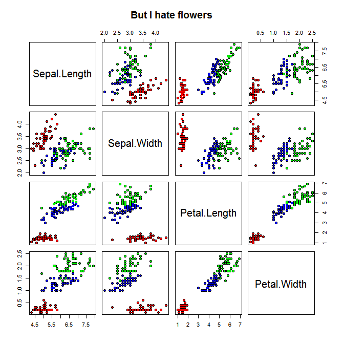
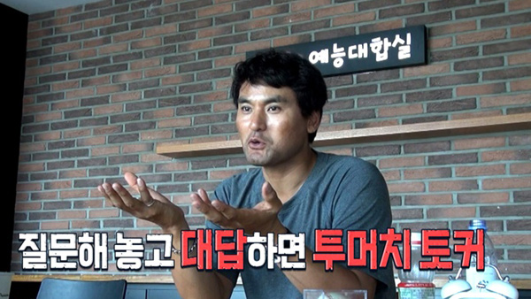

# Do You Wanna Fit A Linear Regression Model

For my wife who is a newbie at fitting regression model in `R` and `SAS`


- [SAS - Regression (2021.07.16 Fri)](/Regression%20Analysis#sas---regression-20210716-fri)
- [R - Regression (Edcat / Doctor) (2019?)](/Regression%20Analysis#r---regression-edcat--doctor-2019)
- [R - Matrix Operation (2019.03.17 Sun)](/Regression%20Analysis#r---matrix-operation-20190317-sun)
- [R - Iris (2019.03.15 Fri)](/Regression%20Analysis#r---iris-20190315-fri)


## [SAS - Regression (2021.07.16 Fri)](/Regression%20Analysis#do-you-wanna-fit-a-linear-regression-model)
There're very rare husbands who can help their wives' `SAS` work, but she's got it.  
(※ Some specific informations are removed or replaced.)
```sas
/* read data from .sas7dbat file */

libname test '{path}';

data mydata;
    set '{path\file.sas7dbat}';
run;

/* proc contents; */
/* run; */
```
```sas
/* test : each market's asset mean */

proc univariate data = test.mydata;
    by mkttype;
    var at;
    output out = test.mymean
        mean = at_mean std = at_std;
run;

proc print data = test.mymean;
run;
```
```sas
/* regression test : asset ~ liabilities capital */

proc corr data = test.mydata;
    var at lt capital;

proc reg data = test.mydata;
    model at = lt capital / dw vif collin selection = backward;
    /* option (show ouput for each obs.) : p - predicted value, clm - confidence interval, r - residual */
    /* option : stb - standardized estimate */
run;
```
```sas
/* dummy variable (ex)
    d1 = 0; d2 = 0;
    if var1 = 1 then d1 = 1;
    if var2 = 1 then d2 = 1;

    model y = x1 x2 d1 d2;
*/

/* variable transformation (ex)
    data mydata;
        set 'path';
        x1long = log(x1);
        x2exp = exp(x2);
        x3sq = x3^2;
    run;

    * non-linear regression : use "nlin" or "model" instead of "reg"
*/
```
```sas
/* seems there are very many missing obs. ex) ****** */

/* result output style
    : Tools > Options > Preference > Results > Style : Journal (recommended from your hubby)
*/

/* comment : ctrl + / */
/* cancel : shift + ctrl + / */
```


## [R - Regression (Edcat / Doctor) (2019?)](/Regression%20Analysis#do-you-wanna-fit-a-linear-regression-model)
This is a forsaken file that can't be found when and why it has been written, but seems to be related with my wife's R study in 2019.  
But, one thing is for certain, it never would be written for me!

```R
## Read Data

  library(Ecdat)
  data(Doctor)

  str(Doctor)
```
.PNG)

```R
  head(Doctor)
  head(Doctor[,2:4])
```
.PNG)

```R
attach(Doctor)

  doctor.dep <- as.matrix(Doctor[,1])
  doctor.var <- as.matrix(Doctor[,2:4])

  solve(crossprod(doctor.var),t(doctor.var)%*%doctor.dep)
```
.PNG)


```R
  lm(doctor~children+access+health)

detach(Doctor)
```
.PNG)

It's hell easy, right?


## [R - Matrix Operation (2019.03.17 Sun)](/Regression%20Analysis#do-you-wanna-fit-a-linear-regression-model)

Practice of matrix operation related with the linear regression analysis

```R
a <- matrix(rep(1:6), ncol=2)
a
```
.PNG)

#### - `t()` : get the transpose matrix(전치행렬) of matrix x
```R
b <- t(a)
b
```
.PNG)

#### - Use of `%*%` operator and `crossprod()`

##### 1) good
```R
b %*% a
crossprod(a)
```
.PNG)

##### 2) bad
```R
a %*% b
crossprod(b)
```
.PNG)


## [R - Iris (2019.03.15 Fri)](/Regression%20Analysis#do-you-wanna-fit-a-linear-regression-model)

#### ※ Why do I choose the dataset `iris`?

That's just because it is a famous dataset for fool newbies.  
I don't mean this data is suitable for a simple linear regression model.  
It was just caused by your request of showing matrix operation and `lm()` function use.

### 1. Using `as.matrix()`

This function forces anything to matrix regadless of its will, such like your eyes have made me fall in love.

```R
iris.dep <- as.matrix(iris[,1])  
iris.var <- as.matrix(iris[,2:4])

lm(iris.dep~iris.var)
```
.PNG)

### 2. Using `rbind()`/`cbind()`

```R
iris.dep2 <- cbind(iris[,1])
iris.var2 <- cbind(iris[,2:4])

lm(iris.dep2~iris.var2)
```
.PNG)

I hate damn `rbind()`/`cbind()`.

### 3. Just input the dataset into `lm()` directly

Actually there's not any pre-processing necessary.

```R
attach(iris)

lm(Sepal.Length~Sepal.Width+Petal.Length+Petal.Width)
```
.PNG)

### 4. Bonus

If this story ends here, people will guess I am an idiot who doesn't understand `iris` data.  
Please enjoy the real `iris` with the following.

```R
windows(width=7, height=7)
pairs(iris[1:4], pch=21,
      main="But I hate flowers",
      bg=c("red", "blue", "green")[unclass(Species)])
```


---

Thank you. Of course I know you love me.  
May I tell you my story more when I was in LA?

